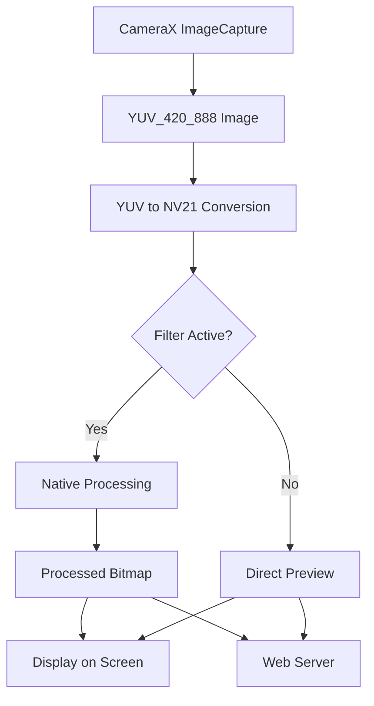

# Edge Detection Software

Edge Detection Software is a cross-platform application that provides real-time image processing capabilities with edge detection and grayscale conversion filters. The project features both Android mobile and web interfaces, utilizing OpenCV for computer vision tasks through a high-performance native implementation.

## Features Implemented

### Android Platform
- **Real-time Camera Processing**: Live camera feed processing with selectable filters
- **Filter Options**:
  - Edge Detection: Real-time Canny edge detection using OpenCV
  - Grayscale Conversion: Convert live feed to grayscale
  - Normal Mode: Unprocessed camera feed
- **Photo Capture**: Save processed images to device gallery with filter applied
- **Dual Camera Support**: Switch between front and back cameras
- **Performance Metrics**: Real-time FPS counter and frame statistics
- **Embedded Web Server**: Built-in NanoHTTPD server for web-based viewing

### Web Platform
- **Live Streaming Viewer**: Real-time viewing of processed camera feed in browser
- **Interactive Controls**:
  - Refresh rate adjustment (100ms to 2 seconds)
  - Manual refresh button
  - Filter selection (Normal, Grayscale, Edge Detection)
- **Performance Dashboard**: Real-time display of FPS, frame count, errors, and resolution
- **Responsive Design**: Works on both desktop and mobile browsers
- **Connection Status**: Visual indicators for connection state


### Prerequisites
- Android Studio with NDK support
- OpenCV Android SDK (included in project)
- Node.js and npm for web development
- Android device or emulator running API 24+

### Android NDK Configuration
1. Install Android NDK through Android Studio SDK Manager
2. The project automatically configures NDK with these settings in `app/build.gradle.kts`:
   ```kotlin
   externalNativeBuild {
       cmake {
           cppFlags("-std=c++11", "-frtti", "-fexceptions")
           arguments(
               "-DOpenCV_DIR=" + project.rootDir.absolutePath + "/OpenCV/native/jni",
               "-DANDROID_STL=c++_shared"
           )
       }
   }
   ndk {
       abiFilters += listOf("arm64-v8a", "armeabi-v7a", "x86", "x86_64")
   }
   ```

### OpenCV Integration
OpenCV is pre-integrated in the project:
1. Native libraries are included in the [OpenCV](OpenCV) directory
2. CMake automatically links OpenCV libraries:
   ```cmake
   find_package(OpenCV REQUIRED COMPONENTS core imgproc)
   target_link_libraries(${CMAKE_PROJECT_NAME} android log jnigraphics ${OpenCV_LIBS})
   ```
3. Java bindings are available through the OpenCV module

### Environment Setup

#### Android Development
1. Clone the repository
2. Open project in Android Studio
3. Allow time for Gradle sync and NDK compilation
4. Connect Android device or start emulator
5. Run the application

#### Web Development
The web component is automatically built and deployed as part of the Android application. No separate npm commands are required for normal operation.

### Running the Application
1. Launch the Android app on your device
2. Grant camera permissions when prompted
3. Access the web viewer at `http://[device-ip]:8080` from any browser
4. Use the switch camera button's long-press feature to open web viewer directly

Note: There is a dedicated button in the Android app's interface that opens the web server interface directly, making manual URL access unnecessary. Simply press the "Open Web Viewer" button in the app to launch the web interface in your default browser.

## Architecture Overview

### JNI Implementation
The project leverages JNI for high-performance image processing:

1. **Native Methods**: C++ implementations in [native-lib.cpp](app/src/main/cpp/native-lib.cpp) provide:
   - Bitmap to OpenCV Mat conversion
   - Mat to Bitmap conversion
   - Canny edge detection
   - Grayscale conversion
   - YUV_420_888 frame processing
   - Memory management for native objects

2. **Java Interface**: [NativeOpenCVHelper.kt](app/src/main/java/com/example/ffddas/NativeOpenCVHelper.kt) wraps native methods with error handling

3. **Performance Benefits**:
   - Direct memory access between Java and native code
   - Optimized OpenCV operations in C++
   - Reduced garbage collection overhead

### Frame Processing Flow



1. **Camera Input**: CameraX captures YUV_420_888 format frames
2. **Format Conversion**: YUV data converted to NV21 for OpenCV processing
3. **Filter Application**: Based on user selection, frames are processed through native OpenCV functions
4. **Output Generation**: Processed frames converted to Bitmap for display
5. **Dual Distribution**: Frames sent to both Android UI and embedded web server

### TypeScript Integration

The web interface is built with TypeScript for type safety and maintainability:

1. **Core Component**: [FrameViewer](web/src/index.ts) class manages:
   - Canvas rendering
   - WebSocket-like frame fetching
   - Performance metrics
   - UI state management

2. **Build Process**: TypeScript compiled to JavaScript with:
   - ES6 target for modern browser support
   - Module bundling for efficient loading
   - Source maps for debugging

3. **API Communication**: Web client interacts with embedded server through:
   - `/frame` - JPEG frame streaming
   - `/setFilter` - Filter mode selection
   - `/api/status` - Application status information

## Technical Details

### Native Processing Pipeline
The C++ implementation in [native-lib.cpp](app/src/main/cpp/native-lib.cpp) provides optimized image processing:

1. **Memory Management**: Smart pointers for automatic Mat cleanup
2. **Format Handling**: Support for RGBA, RGB, and Grayscale conversions
3. **Error Handling**: Comprehensive logging and exception handling
4. **Performance Optimizations**: Direct buffer access and efficient algorithms

### Web Server Architecture
The embedded NanoHTTPD server in [WebServerService.kt](app/src/main/java/com/example/ffddas/WebServerService.kt) provides:

1. **Static Content Serving**: HTML, CSS, and JavaScript files
2. **Dynamic Frame Serving**: Real-time JPEG frame streaming
3. **API Endpoints**: RESTful interface for control commands
4. **Lightweight Processing**: Simple filters for web preview to reduce native load

## Development Guidelines

### Adding New Filters
1. Implement native processing function in [native-lib.cpp](app/src/main/cpp/native-lib.cpp)
2. Add JNI wrapper in [MainActivity.kt](app/src/main/java/com/example/ffddas/MainActivity.kt)
3. Update [NativeOpenCVHelper.kt](app/src/main/java/com/example/ffddas/NativeOpenCVHelper.kt) with safe wrapper
4. Add UI controls in [activity_main.xml](app/src/main/res/layout/activity_main.xml)
5. Update [OpenCVImageAnalyzer.kt](app/src/main/java/com/example/ffddas/OpenCVImageAnalyzer.kt) to apply filter

### Extending Web Interface
1. Modify HTML structure in [WebServerService.kt](app/src/main/java/com/example/ffddas/WebServerService.kt)
2. Add new API endpoints in the serve method
3. Update TypeScript in [index.ts](web/src/index.ts) for new functionality
4. Rebuild with `npm run build`

## Troubleshooting

### Common Issues
1. **Camera Permission Denied**: Ensure camera permission is granted in Android settings
2. **Black Screen**: Check if camera is being used by another application
3. **Web Viewer Not Loading**: Verify device and computer are on same network

   
5. **Build Failures**: Ensure NDK is properly installed and ANDROID_NDK_HOME is set

### Performance Optimization
1. Adjust frame processing interval in [OpenCVImageAnalyzer.kt](app/src/main/java/com/example/ffddas/OpenCVImageAnalyzer.kt)
2. Modify Canny thresholds in native code for different edge detection sensitivity
3. Reduce JPEG quality for faster web streaming in [WebServerService.kt](app/src/main/java/com/example/ffddas/WebServerService.kt)
